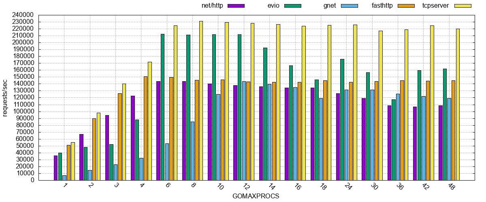
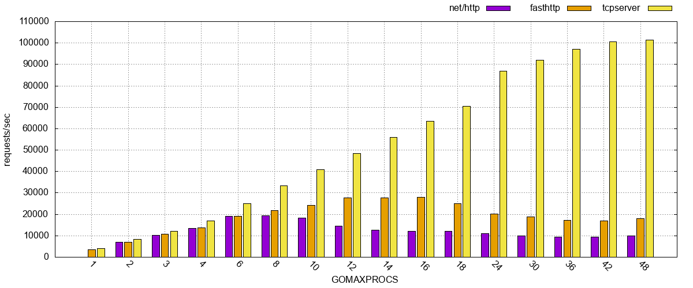
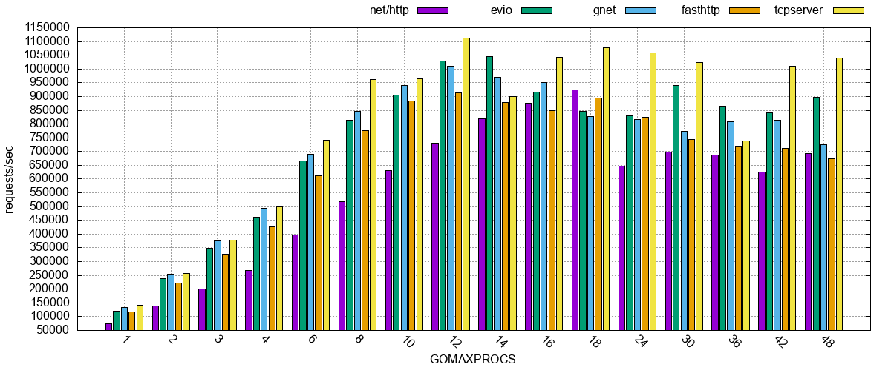
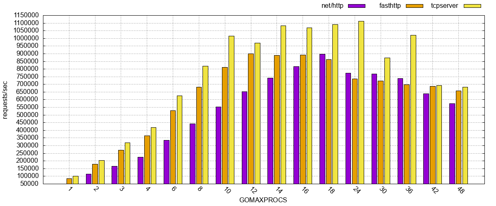
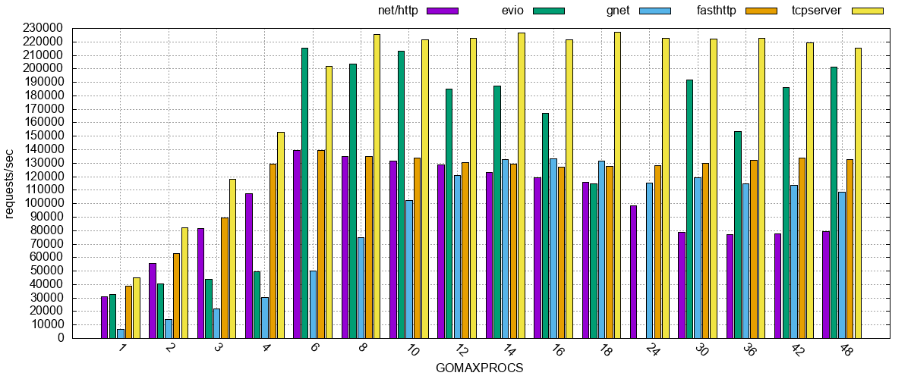
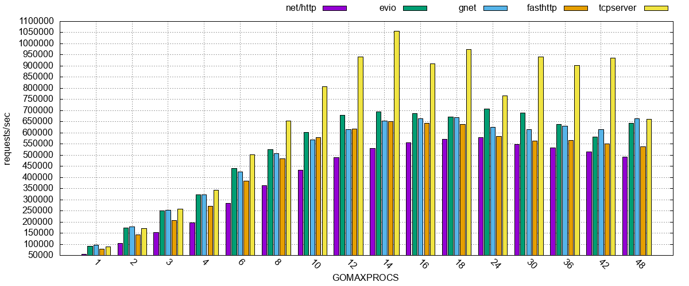
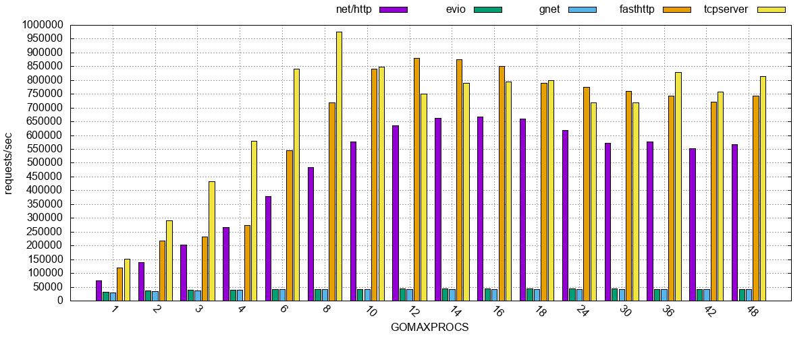
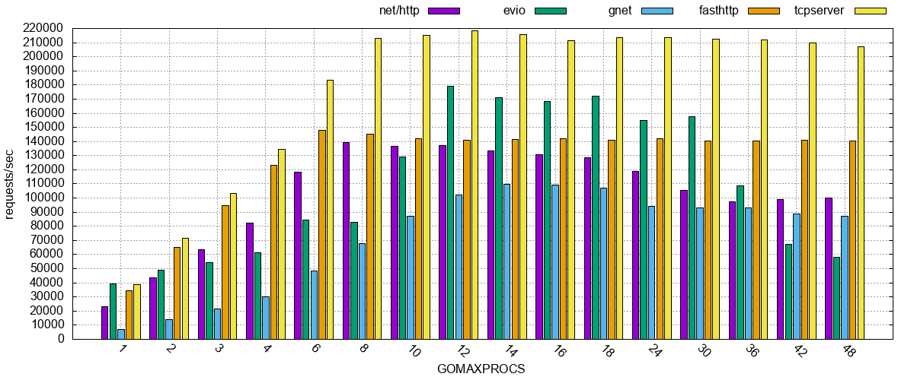

# tcpserver

*tcpserver* is an extremely fast and flexible **IPv4 and IPv6** capable TCP server with **TLS support**, graceful shutdown, **Zero-Copy** (on Linux with splice/sendfile) and supports TCP tuning options like `TCP_FASTOPEN`, `SO_REUSEPORT` and `TCP_DEFER_ACCEPT`.

This library requires at least Go 1.11 but has no other dependencies, does not contain ugly and incompatible hacks and thus fully integrates into Go's `net/*` universe.


## Architecture
*tcpserver* uses a multi-accept-loop approach combined with an adaptive spawning go routine pool for incoming connections.

Each connection lives in it's own go routine and it served using a request handler function (`RequestHandlerFunc func(conn tcpserver.Connection)`).
The connection is automatically closed when the request handler function returns.

Memory allocations in hot paths are reduced to a minimum using `sync.Pool` and the go routine pool from [`maurice2k/ultrapool`](https://github.com/maurice2k/ultrapool)

As *tcpserver* does not implement a non-blocking/asynchronous event loop itself (like packages such as *evio* or *gnet*) it is fully compatible with everything that is built on top of `net.TCPConn`.


## Example (echo server)

```golang
server, err := tcpserver.NewServer("127.0.0.1:5000")

server.SetRequestHandler(requestHandler)
server.Listen()
server.Serve()

func requestHandler(conn tcpserver.Connection) {
    io.Copy(conn, conn)
}
```

## Benchmarks

Benchmarks are always tricky, especially those that depend on network operations. I've tried my best to get fair and realistic results (given that these benchmarks are of course very synthetic).

The test server, an *AWS c5.metal* dual `Intel(R) Xeon(R) Platinum 8275CL CPU @ 3.00GHz` machine with a total of 96 cores and 192 GB of memory, was installed with latest Amazon Linux 2, Linux Kernel 4.14.214-160.339.amzn2.x86_64 and Golang 1.16. There were no other network daemons running except for SSH.


The tests are performed using a super simple HTTP server implementation on top of tcpserver and the other tested libraries. HTTP is well known, there are good benchmarking tools and it's easy to test throughput (using HTTP Keep-Alive) as well as handling thousands of short-lived connections.

[Bombardier](https://github.com/codesenberg/bombardier) (version [1.2.5](https://github.com/codesenberg/bombardier/releases/tag/v1.2.5) from 2020-10-15) was used as HTTP benchmarking tool.

The following libraries were benchmarked:
- [net/http](https://golang.org/pkg/net/http/) (Go's own HTTP server implementation)
- [evio](https://github.com/tidwall/evio)
- [gnet](https://github.com/panjf2000/gnet)
- [fasthttp](https://github.com/valyala/fasthttp) (just to see a good HTTP library, also based on `net/*` like tcpserver)
- [tcpserver](https://github.com/maurice2k/tcpserver)

All tests were performed against localhost.

**Hint**: If you're looking for a high performant HTTP library, just use [fasthttp](https://github.com/valyala/fasthttp). It is extremly fast and has extraordinary good HTTP support. The second best option is probably to stick to [net/http](https://golang.org/pkg/net/http/). evio, gnet and tcpserver are primarily designed for other use cases like your own protocols, proxy servers and the like. Don't re-invent the wheel ;)

## Test #1: Static 1kB content massive connections test
1000 concurrent clients, 1kB of HTTP payload returned, Keep-Alive turned off, 10 seconds (each HTTP request is a new connection).


## Test #1.1 (with TLS): Static 1kB content massive connections test
1000 concurrent clients, 1kB of HTTP payload returned, Keep-Alive turned off, 10 seconds (each HTTP request is a new connection).\
Only *net/http*, *fasthttp* and *tcpserver* have been benchmarked, as *evio* and *gnet* do not support TLS.


## Test #2: Static 1kB content throughput test
1000 concurrent clients, 1kB of HTTP payload returned, Keep-Alive turned on, 10 seconds (establishes exactly 1000 TCP connections that are serving HTTP requests).


## Test #2.1 (with TLS): Static 1kB content throughput test
1000 concurrent clients, 1kB of HTTP payload returned, Keep-Alive turned on, 10 seconds (establishes exactly 1000 TCP connections that are serving HTTP requests).\
Only *net/http*, *fasthttp* and *tcpserver* have been benchmarked, as *evio* and *gnet* do not support TLS.


## Test #3: AES-128-CBC crypted 1kB content massive connections test
1000 concurrent clients, 1kB of AES-128-CBC crypted HTTP payload returned, Keep-Alive turned off, 10 seconds (each HTTP request is a new connection).


## Test #4: AES-128-CBC crypted 1kB content throughput test
1000 concurrent clients, 1kB of AES-128-CBC crypted HTTP payload returned, Keep-Alive turned on, 10 seconds (establishes exactly 1000 TCP connections that are serving HTTP requests).


## Test #5: Static 128 byte content throughput test with additional 1ms sleep
1000 concurrent clients, 128 bytes of HTTP payload returned and 1 ms sleep, Keep-Alive turned on, 10 seconds (establishes exactly 1000 TCP connections that are serving HTTP requests).


## Test #6: Static 16kB content massive connections test
1000 concurrent clients, 16kB of HTTP payload returned, Keep-Alive turned off, 10 seconds (each HTTP request is a new connection).


## Why?
I always find it enlightening to know why someone did something. That's why this section is here.

When I started writing a new [high performance SOCKS5 and HTTP proxy server](https://github.com/maurice2k/moproxy) to replace `danted` in my setup, I realized that I needed some functionality that goes beyond the core listen-accept-handle logic like graceful restart/shutdown and strict error handling.

I evaluated `evio` and later `gnet` but that reminded me of doing async IO in PHP a decade ago which might have been a necessity there but Go has it's own event loop and I was curious why one would re-implement all this in a client library and relinquish the way you write network code in Go (basically by using a goroutine per connection) &ndash; the answer ~~is~~ was *speed*.

I started benchmarking the mentioned libraries against a naive `go handle(...)` approach and it soon turned out that spawning a *new* goroutine for each connection was simply too expensive.
After creating a new [goroutine worker pool](https://github.com/maurice2k/ultrapool) (modeled after the one found in `fasthttp`) I was able to reach numbers (in reqs/sec) that were on par with these libraries.

Now, after some rounds of optimization, `tcpserver` is *faster in almost all benchmarks* than any other library I've come across and you get zero-copy and TLS "for free" &ndash; simply by using Go's own `net/*` functionality!

## License

*tcpserver* is available under the MIT [license](LICENSE).
